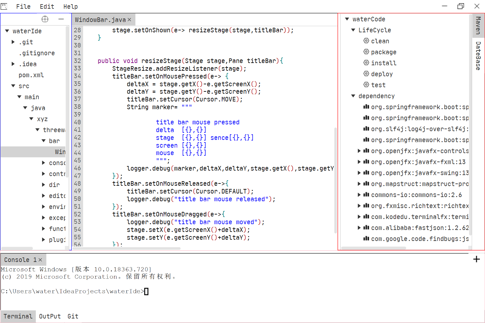

## WaterCode

code editor for java
========================


Build
========================

```
mvn jfx:native
```

Requirements
========================
* JDK8

OS-specific requirements
========================
* (Windows) EXE installers: Inno Setup
* (Windows) MSI installers: WiX (at least version 3.7)
* (Linux) DEB installers: dpkg-deb
* (Linux) RPM installers: rpmbuild
* (Mac) DMG installers: hdiutil
* (Mac) PKG installers: pkgbuild

 

